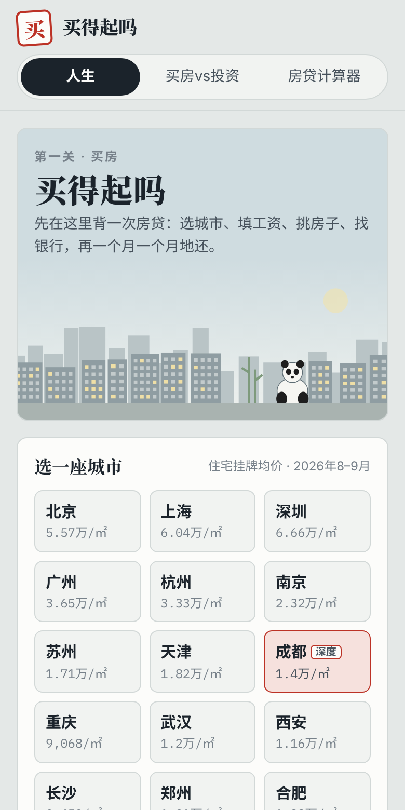
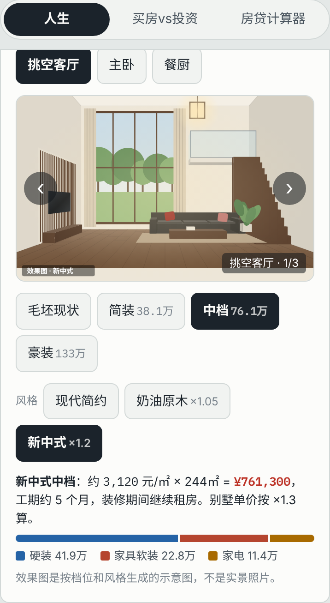
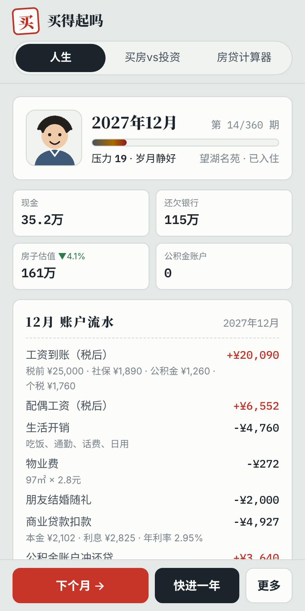

# 买得起吗

一个开源的消费模拟游戏。第一关是**买房**：选城市、填工资、挑房子、找银行，然后一个月一个月地还房贷，看看冲动消费和有计划消费的差别。

它不劝人别买，而是让你在游戏里先背一次房贷：月供吃掉多少工资、哪年利息最多、借网贷凑首付会怎样、被裁员时还不还得上，以及如果当初租房把钱拿去投资，现在差多少。

<p>
  
  
  
</p>

## 能玩什么

- **20 个城市**：房价来自 2026 年 8–9 月住宅挂牌均价。成都是深度版，有 12 套房，包括老破小学区房、四代宅、大平层、联排和独栋别墅。
- **贷款**：首付比例、年限、等额本息/等额本金、公积金组合贷、4 家虚构银行，审批按收入和征信来。
- **借钱凑首付**：亲友、消费贷、信用卡分期、某呗、网贷、非法高利贷（平台名称都是虚构的），借了会有后果。
- **户型图和装修效果图**：按档位（简装、中档、豪装）和风格（现代简约、奶油原木、新中式、轻奢、意式极简）切换。
- **按月还贷**：工资条、公积金冲还贷、每年利率重定价、随机事件（裁员、生病、结婚、生娃、期房延期）、逾期和法拍。
- **平行宇宙**：同样的人生，如果租房并把钱拿去定投，净资产会怎样。
- **工具**：买房 vs 投资对比、房贷计算器（组合贷、提前还款）。
- **术语解释**：带"?"的词点开就有大白话说明。

## 怎么玩

- **网页版**：<https://askxiaozhang.github.io/can-i-afford-it/>
- **TapTap**：准备上架中（H5 小游戏）。
- **下载版**：在 [Releases](https://github.com/askxiaozhang/can-i-afford-it/releases) 里下载 `can-i-afford-it-v版本号.html`，双击用浏览器打开，断网也能玩。
- **装到手机**：用手机浏览器打开网页版，选"添加到主屏幕"，之后可以离线玩。

## 隐私

你填的工资、存款和游戏存档，只保存在你自己设备的浏览器里，不上传到任何服务器，不做统计。网页版和下载版不加载任何第三方字体、统计或广告脚本。

TapTap 版有激励视频广告，只在玩家主动点"看一段广告支持作者"时播放，广告由 TapTap 平台提供。

## 本地开发

需要 Node.js 18 或更新版本。

```bash
npm install
npm run dev          # 本地开发，浏览器打开提示的地址
npm test             # 单元测试 + 整局模拟回归
npm run build        # 网页版（PWA，可安装、离线）→ dist/
npm run build:release  # 下载版单文件 HTML + TapTap H5 上传包 → release/
```

## 项目结构

```
src/
  core/      纯计算：房贷公式、个税、贷款审批、人生引擎、买房vs投资模型（有单元测试）
  data/      所有可更新的数字：城市房价、利率政策、银行、借贷平台、装修、户型、术语（JSON）
  art/       插图：天际线、房源外观、户型图、装修效果图（全部 SVG 现场生成）
  ui/        界面：每个页面一个文件，events.js 统一处理点击和输入
  platform/  平台层：网页版和 TapTap 版各自的广告、内购（预留）、打赏和隐私说明
  config.json  仓库地址、打赏链接、TapTap 广告位（没填的不显示）
tests/       Vitest 测试
scripts/     打包下载版和 TapTap 上传包
```

## 数据和贡献

房价、利率和政策都会过时。所有数字都在 `src/data/` 下的 JSON 里，带有截止日期，更新后跑一遍 `npm test` 就能检查格式。欢迎提交：

- 更新某个城市的房价或利率政策
- 为你所在的城市做一个深度包（参考 `src/data/cities/chengdu.json`）
- 新的随机事件、修正说明文字

详见 [CONTRIBUTING.md](CONTRIBUTING.md)，数据来源见 [DATA_SOURCES.md](DATA_SOURCES.md)。

## 支持作者

游戏永久免费，不卖数据，也不会加借贷类广告。觉得有用的话：

- 网页版和下载版：游戏里"关于 · 支持作者"可以打赏（作者在 `src/config.json` 里配置渠道后才会显示）。
- TapTap 版：可以主动看一段广告。只换一句谢谢，不影响游戏里的任何数字。

发布和上架步骤见 [PUBLISHING.md](PUBLISHING.md)。

## 许可证

- 代码：[GPL-3.0-or-later](LICENSE)。任何人都可以使用、修改和再发布，但修改后的版本也必须开源。
- 数据和文案（`src/data/` 下的 JSON、游戏内文字）：[CC BY-SA 4.0](LICENSE-DATA.md)。
- 数字字体 IBM Plex Mono：SIL Open Font License 1.1，见 `src/assets/fonts/OFL-LICENSE.txt`。

## 免责声明

游戏里的利率、房价、政策都是简化后的模拟，随机事件和投资收益也是假设值，**不构成任何理财或投资建议**。真正做决定前，请以银行、公积金中心和税务部门的最新规定为准。

---

**English**: *Can I Afford It?* is an open-source, offline-capable web game about buying a home in China on a real salary: mortgages, provident-fund loans, bank approval, consumer-loan traps, monthly cash flow, and a "rent and invest instead" parallel universe. Code is GPL-3.0-or-later; data and text are CC BY-SA 4.0. All player data stays in the browser.
